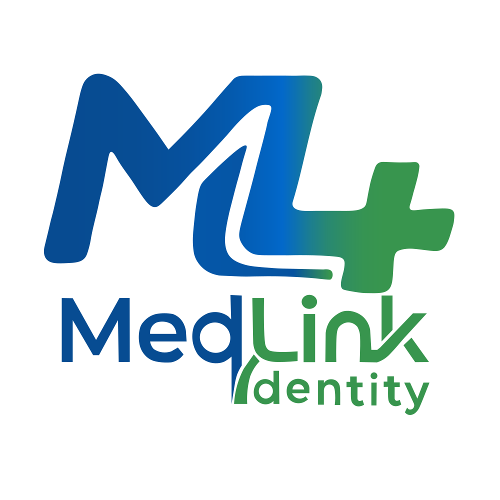

# 🏥 MedLink Identity

<p align="center">
  
</p>

<p align="center">
  <b>المنصة السحابية والحلول الذكية المتقدمة لإدارة المنظومات الطبية والعيادات.</b>
</p>

<p align="center">
  <a href="#-المميزات-الرئيسية">المميزات</a> •
  <a href="#-التقنيات-المستخدمة">التقنيات</a> •
  <a href="#-طرق-التشغيل-والأسعار">خطط الأسعار</a> •
  <a href="#-بدء-التشغيل">بدء التشغيل</a> •
  <a href="#-التواصل-والدعم">التواصل</a>
</p>

---

## 🌟 نبذة عن المشروع

**MedLink Identity** هي منصة متكاملة مخصصة للأطباء والعيادات الطبية توفر نظاماً سحابياً مرناً بالإضافة إلى نسخة محلية (Offline) تعمل بدون الحاجة للاتصال بالإنترنت. يهدف النظام إلى تنظيم إدارة المرضى، الحجوزات، العيادات متعددة الفروع، وسجلات الكشف بكل سهولة وبأعلى مستويات الأمان.

---

## ✨ المميزات الرئيسية

- ⚡ **إدارة كاملة للعيادات والمراكز الطبية**: دعم ربط عيادة واحدة أو عدة عيادات في نظام موحد.
- 🌐 **دعم كامل للغتين (Arabic & English)**: واجهة مستخدم متجاوبة تدعم التغيير السلس بين العربية والإنجليزية.
- 📶 **دعم التشغيل السحابي والأوفلاين**:
  - **النسخة السحابية (Cloud):** متابعة وإدارة العيادة من أي مكان عبر الإنترنت.
  - **النسخة المحلية (Offline):** تعمل بنسبة 100% بدون إنترنت مع قاعدة بيانات محليّة على جهاز العيادة.
- 🎨 **واجهة مستخدم عصرية ومتجاوبة**: مصممة باستخدام **Tailwind CSS** مع دعم كامل للهواتف والأجهزة اللوحية والشاشات الكبيرة.
- 🛡️ **أمان واستقلالية البيانات**: حماية بيانات المرضى والعمليات الطبية وفق أعلى معايير الخصوصية.

---

## 🛠️ التقنيات المستخدمة (Tech Stack)

### 🎨 الواجهة الأمامية (Frontend)
- **React.js** - لبناء مكونات واجهة المستخدم التفاعلية.
- **Vite** - أداة البناء والتطوير السريعة.
- **Tailwind CSS** - لتنسيق الواجهات والتصاميم المجهزة للفراموورك.
- **SVG Icons** - أداء عالي بدون الاعتماد على مكتبات خارجية للأيقونات.

---

## 💳 طرق التشغيل والأسعار

يوفر MedLink خيارات مرنة تناسب جميع أحجام المنظومات الطبية:

| الباقة | السعر | التغطية | نوع التشغيل |
| :--- | :--- | :--- | :--- |
| **الباقة الأساسية (Starter)** | 900 ج.م / شهرياً | حتى 10 عيادات | سحابي (Cloud) |
| **الباقة الاحترافية (Professional)** | 1,600 ج.م / شهرياً | حتى 20 عيادة | سحابي (Cloud) |
| **باقة المؤسسات (Enterprise)** | 2,500 ج.م / شهرياً | عدد غير محدود | سحابي (Cloud) |
| **النسخة الأوفلاين (Local)** | **7,000 ج.م (دفعة واحدة مدى الحياة)** | عيادة محليّة | أوفلاين 100% بدون إنترنت |

---

## 🚀 بدء التشغيل والتثبيت المحلي

لمشروع الواجهة الأمامية وتطويره على جهازك الشخصي:

### 1. استنساخ المستودع (Clone)
```bash
git clone [https://github.com/your-username/medlink-identity.git](https://github.com/your-username/medlink-identity.git)
cd medlink-identity